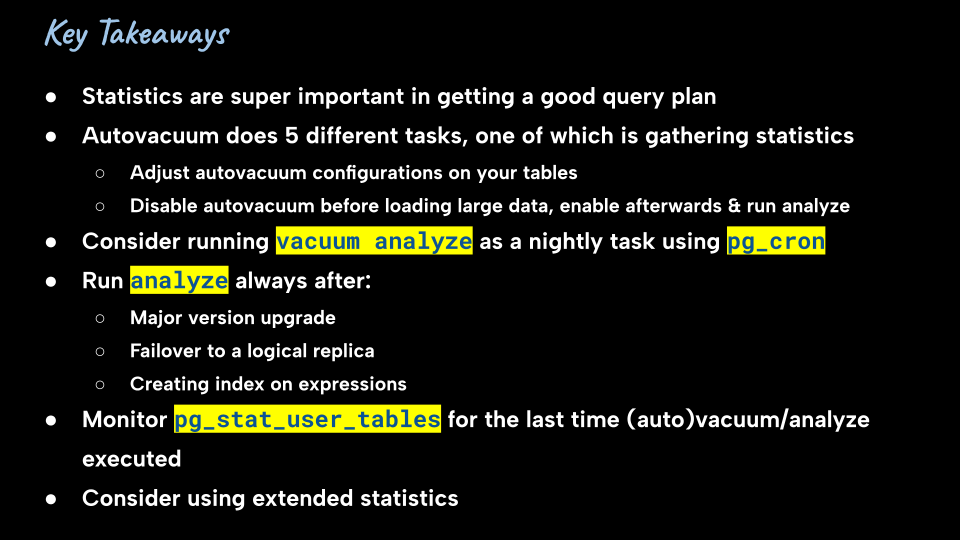

Just run `start.sh`

I assume you have a running PostgreSQL 16+ installed, that can be simply accessed using `psql` (i.e., username, password, database, port, etc. are either default or set via environment variables).

One of the examples uses [pstree](https://en.wikipedia.org/wiki/Pstree) to show PostgreSQL process tree, so be sure it's installed on your system.

By installing [viu](https://github.com/atanunq/viu), you'll get a better experience, as it can display images like this in terminals with natives support for graphics protocol (e.g., iTerm2 and Kitty):

